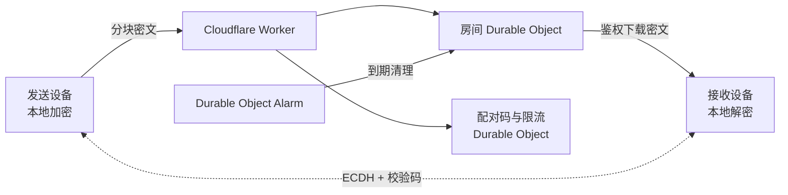

<div align="center">

# 瞬传 InstantFlow

> 不登录、不复制链接，让信息只在两台设备之间短暂存在。  
> Account-free, link-free, end-to-end encrypted temporary transfer.

[](https://github.com/frankfika/instantflow/releases/tag/v0.1.0)
[](https://react.dev/)
[](https://workers.cloudflare.com/)


[在线体验](https://instantflow.chenpitang2020.workers.dev) · [核心功能](#-核心功能) · [快速开始](#-快速开始) · [安全设计](#-安全设计)

__简体中文__ | [English](./README_EN.md)

</div>


## ✨ 项目简介

瞬传是一款用于设备间临时传输的网页工具。发送方选择文件或文字并生成 8 位配对码，接收方在另一台设备输入配对码即可连接。默认核对双方安全码后发送，内容在发送端加密、经服务端短暂中转，并只在接收端解密。

| 常见临时传输方式 | 瞬传 |
| --- | --- |
| 注册账号或安装客户端 | 浏览器打开即用 |
| 复制并暴露长期分享链接 | 8 位一次性配对码 |
| 服务端能够读取文件内容 | 浏览器端端到端加密 |
| 依赖手动清理 | 接收成功、撤销或到期自动销毁 |

## 🚀 核心功能

### 1. 文件与文字快速传输

- **两种内容类型**：支持最大 20 MB 的单个文件，以及最多 12,000 字的文字。
- **无需账号**：发送和接收都从同一个首页开始。
- **无需分享链接**：只需告诉对方一次性的 8 位配对码。

### 2. 可见、可核对的安全过程

- **端到端加密**：两台设备通过 ECDH P-256 协商共享秘密，再使用 HKDF-SHA-256 派生 AES-256-GCM 内容密钥。
- **安全码**：默认由发送方确认双方安全码一致后再发送；可信场景下可关闭核对并在连接后自动发送。
- **附加限制**：“仅限同一网络”默认关闭；需要时可手动开启，并可设置至少 8 位的接收密码。
- **用途隔离派生**：接收密码经随机盐和 PBKDF2-SHA-256（210,000 次）生成独立的验证与加密材料。


### 3. 默认短暂存在

- **自动过期**：可选择 1、5 或 10 分钟后删除。
- **阅后即焚**：接收完成后立即删除房间和密文。
- **主动撤销**：发送方可以随时终止传输并使配对码失效。

## 🖼️ 界面导览

| 发送文件 | 配置安全限制 | 输入配对码 |
| --- | --- | --- |
|  |  |  |

## ⚡ 快速开始

### 在线使用

直接访问 [instantflow.chenpitang2020.workers.dev](https://instantflow.chenpitang2020.workers.dev)：

1. 发送设备选择文件或文字，按需调整安全码核对、网络限制和接收密码。
2. 生成配对码，并在接收设备输入。
3. 默认核对两台设备的安全码；若发送方关闭核对则连接后自动发送。
4. 接收成功后，临时数据自动销毁。

### 本地运行

需要 Node.js 20 或更高版本。

```bash
git clone https://github.com/frankfika/instantflow.git
cd instantflow
npm install
npm run dev
```

前端默认运行在 `http://localhost:5173`，本地参考 API 运行在 `http://localhost:8787`。如需使用完整的 Cloudflare 本地运行时：

```bash
npm run dev:edge
```

## 🏗️ 架构



- Cloudflare Worker 同域提供静态网页和 API。
- 每个传输房间使用独立 Durable Object 保存元数据和分块密文。
- 独立 Durable Object 管理配对码映射和跨节点限流。
- Durable Object Alarm 负责到期清理；成功接收或撤销会同步删除。

## 🔐 安全设计

服务器不会接收私钥或内容密钥。密文下载需要接收端独立令牌，令牌在存储中仅保留哈希。应用默认启用 CSP、HSTS、防嵌入、MIME 防嗅探、同源限制与无缓存响应。

进一步了解：[安全模型](./SECURITY.md) · [隐私说明](./PRIVACY.md) · [安全审计](./SECURITY_AUDIT.md)

> 瞬传可以降低服务端读取临时内容的风险，但不能替代对设备本身、浏览器环境或通信对象身份的信任判断。

## 🧪 验证与发布

```bash
npm test
npm run typecheck:worker
npm run deploy:dry-run
```

边缘冒烟测试需先运行 `npm run dev:edge`，再在另一个终端执行 `npm run test:edge`。README 截图可在本地应用启动后通过 `npm run screenshots` 重新生成。

生产发布方式与密钥配置见 [DEPLOYMENT.md](./DEPLOYMENT.md)。

## 📦 版本

当前版本为 [v0.1.0](https://github.com/frankfika/instantflow/releases/tag/v0.1.0)，更新记录与发布说明请查看 [GitHub Releases](https://github.com/frankfika/instantflow/releases)。
