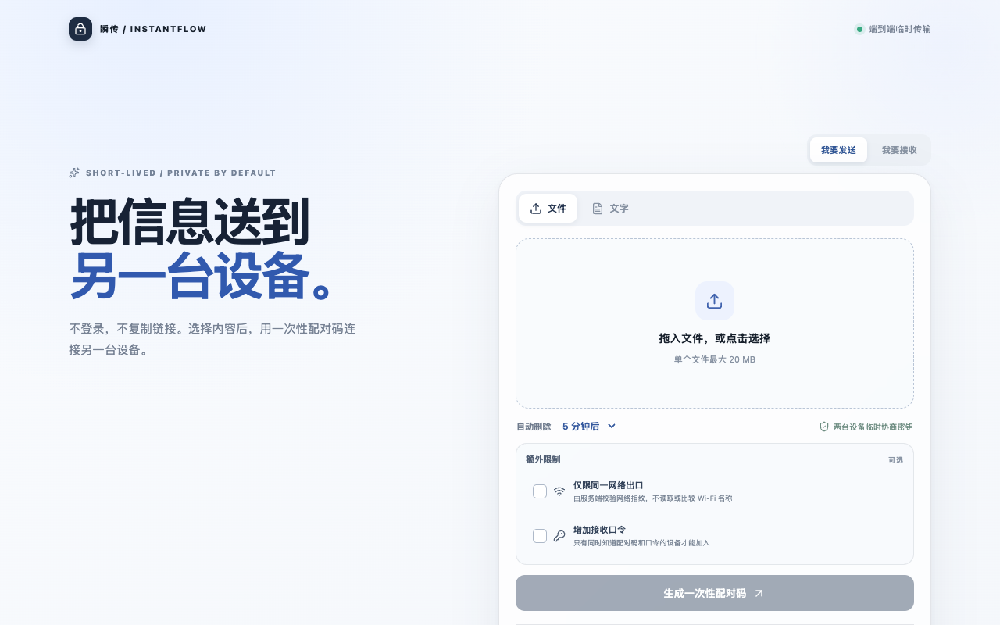
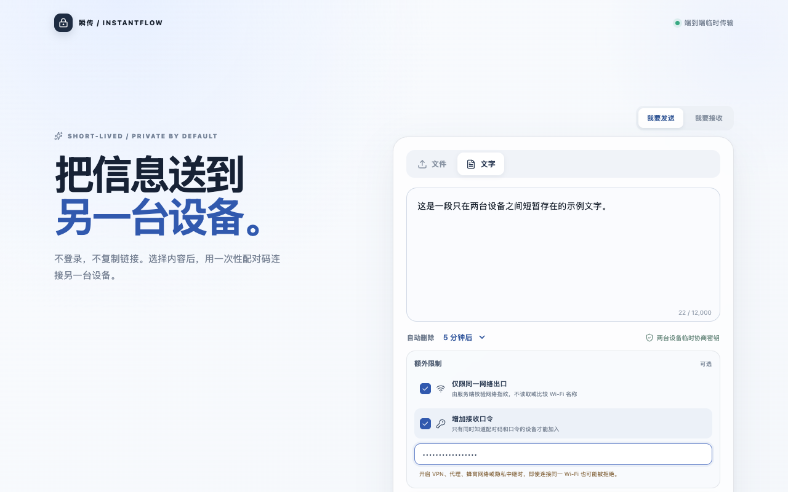
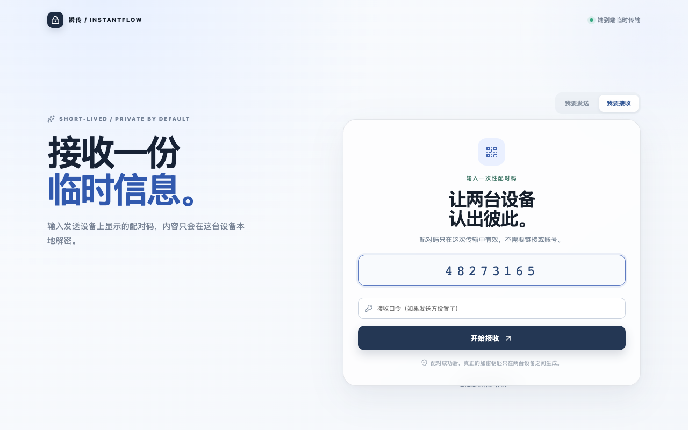
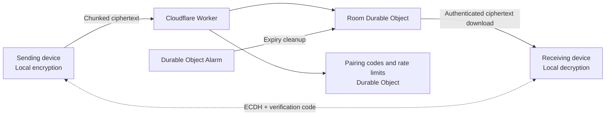

<div align="center">

# InstantFlow

> No account. No copied link. Let information exist briefly between two devices.  
> 不登录、不复制链接，让信息只在两台设备之间短暂存在。

[](https://github.com/frankfika/instantflow/releases/tag/v0.1.0)
[](https://react.dev/)
[](https://workers.cloudflare.com/)


[Live Demo](https://instantflow.chenpitang2020.workers.dev) · [Features](#-features) · [Quick Start](#-quick-start) · [Security](#-security)

[简体中文](./README.md) | __English__

</div>



## ✨ Introduction

InstantFlow is a web app for temporary information exchange. The sender selects a file or text and creates an eight-digit, one-time pairing code. The receiver enters that code on another device to establish a connection. Content is encrypted on the sender only after both sides verify the same security code, briefly relayed by the server, and decrypted locally by the receiver.

| Typical temporary transfer | InstantFlow |
| --- | --- |
| Account registration or app installation | Open it in a browser |
| Long-lived shared links | Eight-digit one-time pairing code |
| Server-readable file contents | Browser-based end-to-end encryption |
| Manual cleanup | Automatic deletion after receipt, revocation, or expiry |

## 🚀 Features

### 1. Fast file and text transfer

- **Two content types**: Send one file up to 20 MB or up to 12,000 characters of text.
- **No account required**: Sending and receiving start on the same homepage.
- **No shared link**: Tell the other person only the one-time eight-digit pairing code.

### 2. A visible, verifiable security flow

- **End-to-end encryption**: The devices negotiate a shared secret with ECDH P-256, then derive an AES-256-GCM content key with HKDF-SHA-256.
- **Security code**: Transfer starts only after both sides confirm that their verification codes match.
- **Optional restrictions**: Require the same network exit and add a receiver passphrase of at least eight characters.
- **Domain-separated derivation**: A passphrase is processed with a random salt and PBKDF2-SHA-256 (210,000 iterations) to derive separate verification and encryption material.



### 3. Ephemeral by default

- **Automatic expiry**: Delete after 1, 5, or 10 minutes.
- **Delete after receipt**: Remove the room and ciphertext immediately after a successful transfer.
- **Sender revocation**: End a transfer at any time and invalidate its pairing code.

## 🖼️ Screenshots

| Send a file | Configure restrictions | Enter a pairing code |
| --- | --- | --- |
|  |  |  |

## ⚡ Quick Start

### Use the hosted app

Open [instantflow.chenpitang2020.workers.dev](https://instantflow.chenpitang2020.workers.dev):

1. Select a file or text on the sending device, then choose an expiry time and optional restrictions.
2. Create a one-time pairing code and enter it on the receiving device.
3. Verify that both devices show the same security code.
4. Confirm the transfer. Temporary server-side data is destroyed after successful receipt.

### Run locally

Node.js 20 or later is required.

```bash
git clone https://github.com/frankfika/instantflow.git
cd instantflow
npm install
npm run dev
```

The frontend runs at `http://localhost:5173` by default and the local reference API at `http://localhost:8787`. To use the full local Cloudflare runtime:

```bash
npm run dev:edge
```

## 🏗️ Architecture



- A Cloudflare Worker serves the static app and API on the same origin.
- Each transfer room uses a dedicated Durable Object for metadata and chunked ciphertext.
- A separate Durable Object manages pairing-code mappings and cross-node rate limits.
- Durable Object Alarms handle expiry; successful receipt or revocation deletes data immediately.

## 🔐 Security

The server never receives a private key or content key. Ciphertext downloads require a receiver-specific token, and only a hash of that token is stored. CSP, HSTS, frame protection, MIME sniffing protection, same-origin restrictions, and no-cache responses are enabled by default.

Learn more: [Security model](./SECURITY.md) · [Privacy notice](./PRIVACY.md) · [Security audit](./SECURITY_AUDIT.md)

> InstantFlow reduces the risk of server-side access to temporary content. It does not replace trust in the devices, browser environment, or the identity of the other participant.

## 🧪 Validation and deployment

```bash
npm test
npm run typecheck:worker
npm run deploy:dry-run
```

For the edge smoke test, run `npm run dev:edge`, then execute `npm run test:edge` in another terminal. With the local app running, regenerate README images using `npm run screenshots`.

See [DEPLOYMENT.md](./DEPLOYMENT.md) for production deployment and secret configuration.

## 📦 Releases

The current version is [v0.1.0](https://github.com/frankfika/instantflow/releases/tag/v0.1.0). See [GitHub Releases](https://github.com/frankfika/instantflow/releases) for release notes and future updates.

